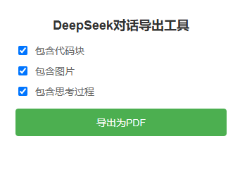

# DeepSeek Chat Exporter 🚀

[](https://opensource.org/licenses/MIT)

> A Chrome extension for easily exporting DeepSeek conversations to PDF
> 
> *— Because some conversations are worth keeping*

## 🌟 Features

- 🎯 One-click PDF export
- 🎨 Preserves original formatting and styles
- 🔧 Optional code block inclusion
- 📷 Optional image inclusion
- 🤔 Optional AI thinking process inclusion
- 📱 Responsive layout support
- 🎭 Light/Dark theme compatible
- 📄 Optimized PDF printing styles

## 📸 Screenshots

### Extension Popup


### Export Result


## 🚀 Installation

1. Download the repository
   ```bash
   git clone https://github.com/aofenghanyue/deepseek-chat-exporter.git
   ```

2. Open Chrome Extensions page
   - Enter `chrome://extensions/` in the address bar
   - Or navigate through: `Menu` -> `More Tools` -> `Extensions`

3. Enable Developer Mode
   - Toggle the "Developer mode" switch in the top right

4. Load the Extension
   - Click "Load unpacked"
   - Select the repository directory

## 🎮 Usage

1. Open [DeepSeek Chat](https://chat.deepseek.com/)
2. Have some conversations
3. Click the extension icon in Chrome toolbar
4. Choose export options:
   - Include code blocks
   - Include images
   - Include thinking process
5. Click "Export to PDF"
6. Save as PDF in the print preview window

## 🔧 Development

### Project Structure
```
deepseek-chat-exporter/
├── manifest.json        # Extension configuration
├── popup.html          # Popup window UI
├── popup.js           # Popup window logic
├── content.js         # Content processing script
├── background.js      # Background service script
├── styles.css         # Styles
└── icons/             # Icon directory
    ├── icon16.png
    ├── icon48.png
    └── icon128.png
```

### Core Features Implementation

1. **Content Extraction**
   - Spatial positioning algorithm for main dialog area
   - Content filtering scoring system
   - Smart user/AI dialogue recognition

2. **Style Processing**
   - Original format preservation
   - Code block optimization
   - Image layout enhancement
   - Print style adaptation

3. **Export Optimization**
   - Automatic image loading
   - Pagination optimization
   - Content integrity preservation

### Development Environment
- Chrome 88+
- JavaScript ES6+
- HTML5
- CSS3

## 🤝 Contributing

1. Fork the repository
2. Create your feature branch (`git checkout -b feature/AmazingFeature`)
3. Commit your changes (`git commit -m 'Add some AmazingFeature'`)
4. Push to the branch (`git push origin feature/AmazingFeature`)
5. Open a Pull Request

## 📝 Changelog

### v1.0.0 (2024-01-28)
- 🎉 Initial release
- Basic PDF export functionality
- Code block and image export support
- Thinking process display option

## 📜 License

This project is licensed under the MIT License - see the [LICENSE](LICENSE) file for details

## 🤔 FAQ

Q: Why is my exported PDF blank?  
A: Make sure the page is fully loaded and you have access to the conversation content.

Q: Why is the PDF formatting messed up?  
A: Try adjusting your browser's print settings, particularly the scale.

Q: What if the extension icon doesn't show up?  
A: Check if the icon files in the icons folder are complete. You can replace them with any PNG images of 16x16, 48x48, and 128x128 pixels.

## 📞 Contact

- Submit Issues: [GitHub Issues](https://github.com/your-username/deepseek-chat-exporter/issues)

---
*Note: This project is not affiliated with DeepSeek. It's just a tool to help users export their conversations.* 