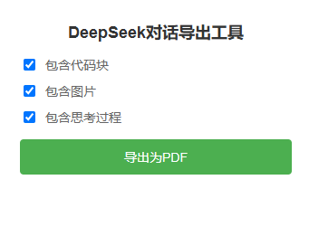

# DeepSeek Chat Exporter 🚀

[](https://opensource.org/licenses/MIT)

> 一个让你轻松导出DeepSeek对话为PDF的Chrome插件
> 
> *——当AI不再神秘，但你还想留个纪念*

## 🌟 特性

- 🎯 一键导出对话内容为PDF
- 🎨 保持原始格式和样式
- 🔧 可选择是否包含代码块
- 📷 可选择是否包含图片
- 🤔 可选择是否包含AI的思考过程
- 📱 适配响应式布局
- 🎭 支持明暗主题
- 📄 优化的PDF打印样式

## 📸 效果展示

### 插件界面


### 导出效果


## 🚀 安装教程

1. 下载本仓库代码
   ```bash
   git clone https://github.com/aofenghanyue/deepseek-chat-exporter.git
   ```

2. 打开Chrome浏览器，进入扩展程序页面
   - 在地址栏输入：`chrome://extensions/`
   - 或者通过菜单：`更多工具` -> `扩展程序`

3. 开启开发者模式
   - 点击右上角的"开发者模式"开关

4. 加载插件
   - 点击"加载已解压的扩展程序"
   - 选择本仓库的目录

## 🎮 使用方法

1. 打开 [DeepSeek Chat](https://chat.deepseek.com/)
2. 进行一些对话
3. 点击Chrome工具栏中的插件图标
4. 根据需要选择导出选项：
   - 是否包含代码块
   - 是否包含图片
   - 是否包含思考过程
5. 点击"导出为PDF"按钮
6. 在打开的打印预览窗口中选择保存为PDF

## 🔧 开发说明

### 项目结构
```
deepseek-chat-exporter/
├── manifest.json        # 插件配置文件
├── popup.html          # 弹出窗口界面
├── popup.js           # 弹出窗口逻辑
├── content.js         # 内容处理脚本
├── background.js      # 后台服务脚本
├── styles.css         # 样式文件
└── icons/             # 图标文件夹
    ├── icon16.png
    ├── icon48.png
    └── icon128.png
```

### 核心功能实现

1. **内容提取**
   - 使用空间定位算法识别主对话区域
   - 通过评分系统过滤无关内容
   - 智能识别用户和AI的对话

2. **样式处理**
   - 保持原始格式
   - 优化代码块显示
   - 美化图片布局
   - 适配打印样式

3. **导出优化**
   - 自动等待图片加载
   - 优化分页逻辑
   - 保持内容完整性

### 开发环境
- Chrome 88+
- JavaScript ES6+
- HTML5
- CSS3

## 🤝 贡献指南

1. Fork 本仓库
2. 创建你的特性分支 (`git checkout -b feature/AmazingFeature`)
3. 提交你的改动 (`git commit -m 'Add some AmazingFeature'`)
4. 推送到分支 (`git push origin feature/AmazingFeature`)
5. 开启一个 Pull Request

## 📝 更新日志

### v1.0.0 (2024-01-28)
- 🎉 首次发布
- 实现基本的PDF导出功能
- 支持代码块和图片导出
- 添加思考过程显示选项

## 📜 开源协议

本项目采用 MIT 协议 - 详见 [LICENSE](LICENSE) 文件

## 🎭 彩蛋：为什么要开发这个插件？

*——以下内容由DeepSeek生成，经过人类严格审核（才怪）*

还记得某天我正在和DeepSeek进行一场激烈的代码讨论，讨论到兴起，我说：
"这段对话太精彩了，得留个纪念！"

正要截图，突然想到：
"等等，一张截图就能装下这满屏的智慧结晶吗？"

于是，这个插件诞生了。

它不仅能导出对话，还能让你选择是否要看到AI的"思考过程"。
就像你可以选择要不要看到厨师在后厨的忙碌，或者魔术师的手法解密。
（不过说实话，有时候AI的思考过程比答案还有意思）

最后，如果你觉得这个插件有用，欢迎关注我的微信公众号"怎么可能"
——虽然目前还在筹备中，但我（不）保证：
- 内容会很有趣（可能）
- 更新会很频繁（可能）
- 会有很多干货（可能）

总之，正如公众号名字所说：怎么可能这么简单呢？😏

## 🤔 常见问题

Q: 为什么我导出的PDF是空白的？  
A: 请确保页面完全加载，并且你有权限访问该对话内容。

Q: 为什么导出的PDF格式乱了？  
A: 请尝试调整浏览器的打印设置，确保缩放比例适当。

Q: 插件图标显示不出来怎么办？  
A: 请检查icons文件夹中的图标文件是否完整。如果不完整，可以使用任意16x16、48x48、128x128像素的PNG图片替换。

## 📞 联系方式

- 提交Issue: [GitHub Issues](https://github.com/aofenghanyue/deepseek-chat-exporter/issues)
- 微信公众号: 怎么可能


---
*注：本项目与DeepSeek官方无关，仅为方便用户导出对话内容的工具。* 